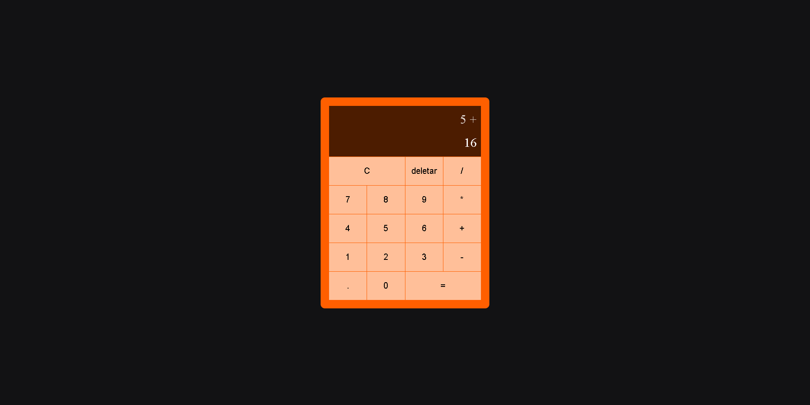

<h1 align="center">Calculadora</h1>

Calculadora feita sem utilizar o método eval do javascript

<h2>Sobre</h2>
	
O objetivo deste projeto é exrecitar a lógica de programação
    

<h3>tecnologias utilizadas:</h3>
	<ul>
		<li>HTML5</li>
		<li>CSS3</li>
		<li>JavaScript</li>
	</ul>

<h2>Preview</h2>
	